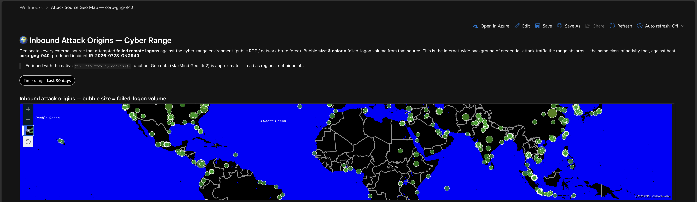

# Sentinel Workbook — Attack Source Geo Map

A Microsoft Sentinel Workbook that plots the external attack sources against host
`corp-gng-940` on a world map, sized by failed-logon volume. The largest bubbles are the
RDP brute-force campaigns (51.161.196.231, 51.11.134.246) that hammered the host but never
succeeded — the visual companion to the incident report's "host was never breached" finding.

Built on `DeviceLogonEvents` and enriched with the native `geo_info_from_ip_address()`
function (MaxMind GeoLite2). Part of the same LAW-Cyber-Range lab as the main incident.

## Import

1. Microsoft Sentinel / Defender → **Workbooks** → **+ Add workbook**.
2. **Edit** → **Advanced Editor** (`</>` icon).
3. Delete the sample JSON, paste in [`attack-geo-map-workbook.json`](attack-geo-map-workbook.json), **Apply**.
4. Set the **Time range** pill to **30 days** (the incident occurred Jul 27–28, 2026).
5. **Save** — e.g. *Attack Source Geo Map — corp-gng-940*.

> Update the workspace resource ID (`crossComponentResources` / `context.ownerId`) to point at your own Log Analytics workspace.

## Files

| File | Purpose |
|------|---------|
| `attack-geo-map-workbook.json` | The importable workbook (map + detail table) |
| `attack-geo-map.png` | Screenshot of the rendered map |
